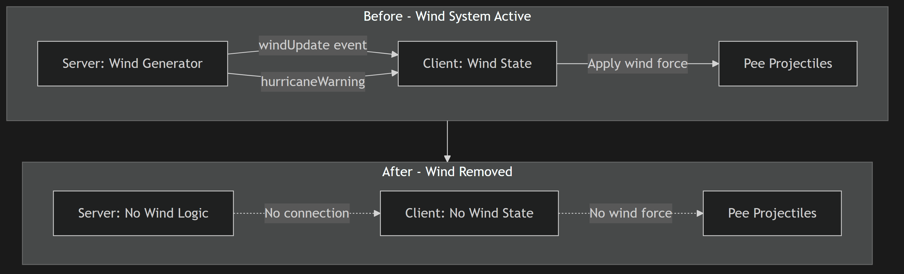
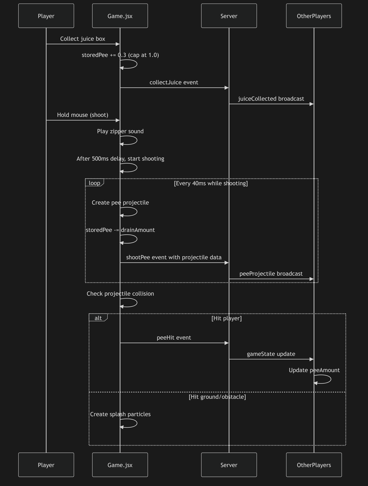

# Issue #16: Remove wind/hurricane mechanics and verify peeing

## Summary
Remove all wind and hurricane mechanics from both server and client code, then verify the peeing mechanic is working correctly.

## Root Cause Analysis
The issue requests removal of wind/hurricane mechanics that were previously implemented but are currently in an inconsistent state:
- **Server (server/index.js)**: Wind and hurricane logic is still ACTIVE (lines 50-52, 145-176) - generates random wind every 10 seconds, 5% chance of hurricane
- **Client (src/Game.jsx)**: Wind and hurricane logic is COMMENTED OUT (lines 797-859) - marked "DISABLED FOR NOW"
- **CSS (src/index.css)**: Wind indicator styles still exist (lines 94-153) but are unused

This creates unnecessary code clutter and potential confusion. The peeing mechanic appears functional but should be verified after cleanup.

## Proposed Solution
1. Remove all wind/hurricane-related code from server, client, and CSS
2. Clean up unused constants, state variables, and event listeners
3. Verify peeing mechanic works correctly (shooting, collision, damage)
4. Test juice box collection and pee storage

## Files to Modify

| File | Change |
|------|--------|
| `server/index.js` | Remove wind, isHurricane, hurricaneTimeLeft from room state (lines 50-52). Remove entire wind update interval (lines 145-176). Remove hurricaneWarning event emission. |
| `src/Game.jsx` | Remove wind-related constants (lines 27-29). Remove wind state refs (lines 263-265). Remove commented-out wind logic block (lines 797-859). Remove wind from HUD sync (lines 871-873). Remove wind force from projectile physics (already commented). |
| `src/index.css` | Remove wind indicator styles (lines 94-153: `.wind-indicator`, `.wind-label`, `.wind-compass`, `.wind-arrow`, `.hurricane-timer`, `@keyframes shake`). |

## New Files
None - this is a cleanup/refactoring issue.

## Implementation Steps

### Step 1: Server Cleanup
1. Remove `wind`, `isHurricane`, `hurricaneTimeLeft` from room creation (lines 50-52)
2. Remove entire `setInterval` block for wind updates (lines 145-176)
3. Verify no other references to wind/hurricane in server code

### Step 2: Client Code Cleanup
1. Remove constants: `WIND_CHANGE_INTERVAL`, `HURRICANE_CHANCE`, `HURRICANE_DURATION` (lines 27-29)
2. Remove refs: `wind`, `isHurricane`, `hurricaneTimeLeft` (lines 263-265)
3. Delete commented-out wind logic block (lines 797-859)
4. Remove wind from HUD sync state (lines 871-873)
5. Verify projectile physics don't reference wind (already commented out at lines 1154-1155)

### Step 3: CSS Cleanup
1. Remove `.wind-indicator` class and `.hurricane` modifier (lines 94-110)
2. Remove `@keyframes shake` animation (lines 112-124)
3. Remove `.wind-label`, `.wind-compass`, `.wind-arrow`, `.hurricane-timer` classes (lines 126-153)

### Step 4: Verify Peeing Mechanic
1. Test juice box collection increases stored pee (30% per box)
2. Test shooting drains stored pee over time
3. Test pee projectile collision with other players
4. Test pee damage accumulation (5% per hit, eliminated at 100%)
5. Test self-collision prevention (150ms grace period)
6. Verify pee sound plays/stops correctly
7. Test zipper sound and delay mechanism

## Test Strategy

### Unit Tests
- Juice box collection: verify storedPee increases by 0.3 per box, capped at 1.0
- Pee shooting: verify projectile creation, velocity, and drain rate
- Pee collision: verify damage application (0.05 per hit)
- Elimination: verify player.alive = false when peeAmount >= 1.0

### Integration Tests
- Multiplayer pee stream visibility (projectile sync via socket)
- Juice box respawn after 10 seconds
- Police chase trigger when peeing in front of NPCs

### Edge Cases
- Shooting with empty stored pee (should not create projectile)
- Self-collision during first 150ms (should not hit self)
- Juice box collection while at full stored pee (should cap at 1.0)
- Multiple players shooting simultaneously

## Risks & Mitigations

| Risk | Mitigation |
|------|------------|
| Accidental removal of unrelated code | Use precise line references, verify with grep after changes |
| Breaking projectile physics | Wind force already commented out - just remove dead code |
| CSS removal affects other elements | Verify wind-specific class names are unique |
| Pee mechanic regression | Manual testing in local practice mode before deployment |

## Diagrams

### Before/After Architecture

### Pee Mechanic Flow (Unchanged - Verify Only)

## Verification Checklist

After implementation, verify:
- [ ] Server starts without errors
- [ ] No console errors related to missing wind variables
- [ ] Juice boxes can be collected
- [ ] Stored pee meter fills when collecting juice
- [ ] Pee stream appears when holding mouse
- [ ] Pee stream disappears when releasing mouse or out of pee
- [ ] Pee hits other players and increases their peeAmount
- [ ] Players are eliminated when peeAmount reaches 1.0
- [ ] Zipper sound plays before shooting
- [ ] Pee sound plays during shooting
- [ ] No wind-related UI elements visible

## Notes
- This is a cleanup issue - no new functionality
- The peeing mechanic should already be functional; this just removes dead code
- All wind-related code is being removed, not disabled
- No breaking changes to game mechanics or multiplayer sync
