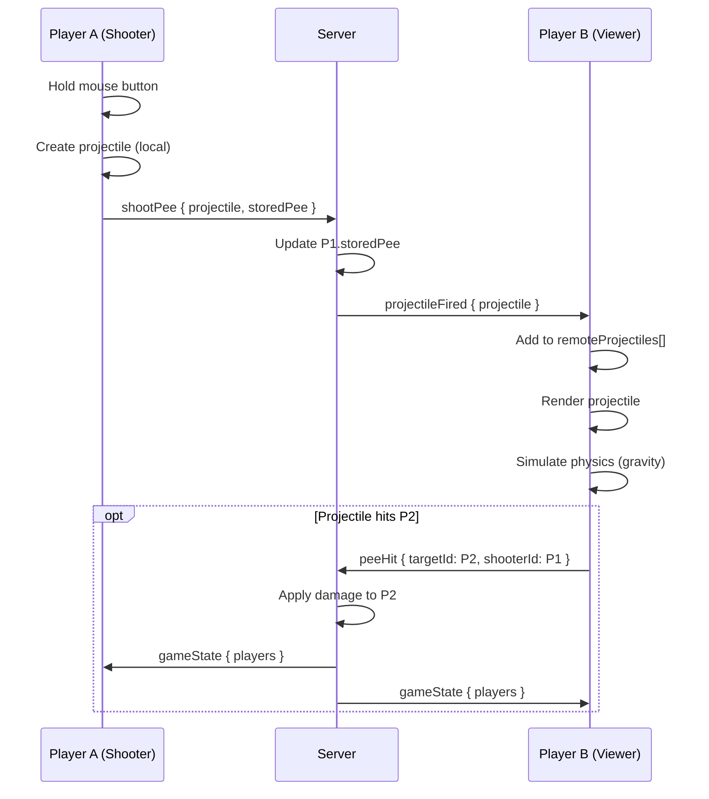

# Issue #2: P0: Sync pee projectiles across network

## Summary

Add network synchronization for pee projectiles so all players in a room can see each other's pee streams, not just feel the damage. This is a critical feature for visual feedback, competitive integrity, and immersion.

## Root Cause Analysis

**Current State:**
- Pee projectiles are stored in a client-side `useRef([])` array in `Game.jsx`
- When a player shoots, projectiles are created and rendered only on their own screen
- The `shootPee()` function emits only the updated `storedPee` amount to the server
- Server broadcasts player state changes but NOT projectile data
- Other players see damage appear instantly with no visual projectile traveling toward them

**Why This Is a Problem:**
- No visual feedback for who is shooting at you
- Cannot see near-misses or learn from opponent's aim patterns
- Damage feels random and disconnected from player actions
- Breaks immersion and competitive integrity
- Listed as P0 Critical in DIAGNOSIS.md

## Proposed Solution

Implement a client-server-client projectile sync system:

1. **Client (Shooter)**: Emit `shootPee` event with full projectile data (position, velocity, owner, timestamp)
2. **Server**: Relay projectile data to all other players in the room
3. **Clients (Receivers)**: Add remote projectiles to a `remoteProjectiles` ref and render them alongside local projectiles
4. **Cleanup**: Remove projectiles after 5 seconds or when they hit the ground

The architecture maintains client-side physics simulation (for smooth rendering) while ensuring all clients receive the same initial projectile state.

## Files to Modify

| File | Change |
|------|--------|
| `src/Game.jsx` | Add `remoteProjectiles` ref, modify `shootPee()` to emit full projectile data, add effect to receive `projectileFired` events, update render to include remote projectiles |
| `server/index.js` | Add `shootPee` event handler to broadcast projectile data to room (currently only broadcasts storedPee update) |

## New Files

| File | Purpose |
|------|---------|
| None | This is a network sync feature - no new files needed |

## Implementation Steps

### Step 1: Update Server to Relay Projectile Data

Modify `server/index.js` `shootPee` handler to broadcast projectile data:

```javascript
socket.on('shootPee', ({ projectile, storedPee }) => {
  const player = players.get(socket.id)
  if (player && player.roomId && player.alive) {
    player.storedPee = Math.max(0, storedPee)
    const room = rooms.get(player.roomId)
    if (room) {
      // Broadcast projectile to all other players
      socket.to(player.roomId).emit('projectileFired', {
        projectile: {
          ...projectile,
          ownerId: socket.id  // Include shooter ID for rendering
        }
      })
      // Still broadcast player state for pee meter updates
      socket.to(player.roomId).emit('gameState', { players: getRoomPlayers(room) })
    }
  }
})
```

### Step 2: Add Remote Projectiles Ref in Game.jsx

Add a new ref to store projectiles from other players:

```javascript
const remoteProjectiles = useRef([])
```

### Step 3: Modify shootPee() to Emit Full Projectile Data

Update the `shootPee()` function to send complete projectile information:

```javascript
const projectile = {
  id: `pee-${Date.now()}-${Math.random()}`,
  position: shootPosition.toArray(),  // Send as array for serialization
  velocity: velocity.toArray(),
  owner: playerId,
  color: '#ffff00',
  size: 0.06,
  createdAt: Date.now()
}

socket.emit('shootPee', { 
  projectile, 
  storedPee: newStoredPee 
})
```

### Step 4: Add Effect to Listen for projectileFired Events

Add a new useEffect to receive and store remote projectiles:

```javascript
useEffect(() => {
  if (!socket) return

  const handleProjectileFired = ({ projectile }) => {
    // Add to remote projectiles array
    remoteProjectiles.current.push({
      ...projectile,
      position: new THREE.Vector3(...projectile.position),
      velocity: new THREE.Vector3(...projectile.velocity)
    })
  }

  socket.on('projectileFired', handleProjectileFired)

  return () => {
    socket.off('projectileFired', handleProjectileFired)
  }
}, [socket])
```

### Step 5: Update useFrame to Simulate Remote Projectiles

Add physics simulation for remote projectiles in the `useFrame` loop:

```javascript
// Update remote projectiles (same physics as local)
remoteProjectiles.current = remoteProjectiles.current.filter(projectile => {
  projectile.position.add(projectile.velocity.clone().multiplyScalar(safeDelta))
  projectile.velocity.y -= 9.8 * safeDelta  // Apply gravity

  // Check collision with local player
  const localPlayerPos = camera.position
  const distance = projectile.position.distanceTo(localPlayerPos)
  if (distance < 1 && projectile.owner !== playerId) {
    // Hit local player
    socketRef.current.emit('peeHit', { 
      targetId: playerId, 
      damage: PEE_DAMAGE,
      shooterId: projectile.owner 
    })
    return false  // Remove projectile on hit
  }

  // Cleanup old projectiles
  const age = Date.now() - projectile.createdAt
  return age < 5000 && projectile.position.y > 0
})
```

### Step 6: Render Remote Projectiles

Add remote projectiles to the render loop alongside local ones:

```javascript
{/* Remote Pee Projectiles */}
{(remoteProjectiles.current || []).map(projectile => {
  const vel = projectile.velocity.clone()
  const len = 0.8
  const up = new THREE.Vector3(0, 1, 0)
  const dir = vel.clone().normalize()
  const quat = new THREE.Quaternion().setFromUnitVectors(up, dir)

  return (
    <mesh key={projectile.id} position={projectile.position} quaternion={quat}>
      <capsuleGeometry args={[projectile.size, len, 4, 8]} />
      <meshStandardMaterial
        color="#ffff00"
        emissive="#ffff00"
        emissiveIntensity={1}
        transparent
        opacity={0.95}
      />
    </mesh>
  )
})}
```

### Step 7: Cleanup on Unmount

Add cleanup to clear remote projectiles when component unmounts:

```javascript
useEffect(() => {
  return () => {
    remoteProjectiles.current = []
  }
}, [])
```

## Test Strategy

### Unit Tests (Post-Implementation)
- Verify projectile data structure matches expected schema
- Test projectile cleanup after 5 seconds
- Test gravity application to remote projectiles

### Integration Tests
- **Multiplayer Test**: Two players in same room
  - Player A shoots → Player B sees projectile
  - Player B gets hit → damage applied correctly
  - Visual projectile matches trajectory

### Edge Cases
- **Projectile cleanup**: Ensure old projectiles don't accumulate
- **Network latency**: Remote projectiles may appear slightly delayed - acceptable for visual sync
- **Self-hits**: With self-damage enabled (future), ensure own projectiles can hit self
- **Multiple shooters**: Handle multiple simultaneous projectiles from different players

## Risks & Mitigations

| Risk | Mitigation |
|------|------------|
| **Network bandwidth**: Sending projectile data frequently could increase bandwidth | Only send on initial shoot, not every frame. Projectiles are small (~100 bytes each). At 10 shots/sec = ~1KB/sec negligible |
| **Projectile desync**: Different clients may simulate slightly different trajectories due to frame rate differences | Acceptable for visual feedback. Server remains authoritative for hit detection |
| **Memory leak**: Projectiles accumulating in array | Implement strict cleanup: remove on hit, on ground impact, or after 5 seconds |
| **Cheating**: Clients could emit fake projectile data | Server validates: checks player has enough storedPee, rate-limits shoots (currently 30ms interval) |

## Diagrams

### Data Flow Architecture



### Before/After Comparison

**Before:**
```
Player A shoots → Only A sees pee → B takes damage (confusing!)
```

**After:**
```
Player A shoots → A sees pee → Server relays → B sees pee → B takes damage (clear!)
```

## Performance Considerations

- **Projectile limit**: Each client renders their own projectiles + all remote projectiles
- **Expected load**: 8 players × 10 shots/sec × 5 second lifetime = ~400 projectiles max
- **Rendering cost**: Capsule geometry is cheap, instanced rendering could optimize further
- **Network cost**: ~100 bytes per projectile × 80 shots/sec (8 players) = ~8KB/sec total

## Success Criteria

- [ ] All players in a room see each other's pee projectiles
- [ ] Projectiles follow consistent parabolic arc across all clients
- [ ] Hit detection works correctly with visual feedback
- [ ] No memory leaks from projectile accumulation
- [ ] Performance remains smooth with 8 players shooting simultaneously

## Related Issues

- Issue #4: Sync juice box positions across network
- Issue #5: Add self-damage (pee on yourself)
- Issue #1: Add wind/hurricane mechanics (will affect projectile trajectory)
